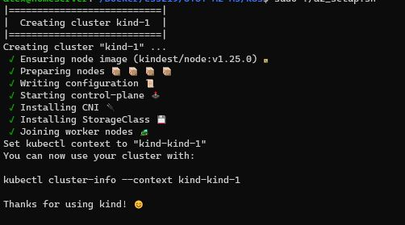
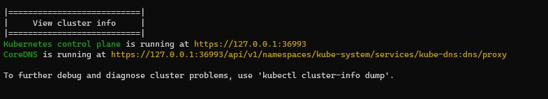

Name: Teo Yick Fong Alex

Student Number: A0221444R

[Github Repo](https://github.com/alexteo98/OTOT-A2-A3)

## Task A2.1 
### Deploy a local k8s cluster
1. Creating a local k8s cluster named `kind-1`
    1. `kind create cluster --name kind-1 --config ./kind/cluster-config.yaml`

2. Verify k8s cluster
    1. `kubectl cluster-info`

## Task A2.2
### Deploy Docker image to Kubernetes as a Deployment with 3 replicas exposed by a Service object
1. Applying Deployment Manifest
    1. `kubectl apply -f ./manifests/deployment.yaml`
2. Viewing Deployment
    1. `kubectl get deploy`

2. Applying Service Manifest
    1. `kubectl apply -f ./manifests/service.yaml`
3. Viewing Service
    1. `kubectl get svc`

## Task A2.3 
### Running the Nginx reverse proxy
1. Creating Ingress-Controller
    1. `kubectl apply -f https://raw.githubusercontent.com/kubernetes/ingress-nginx/main/deploy/static/provider/kind/deploy.yaml`
1. Viewing Ingress-Controller 
    1. `kubectl -n ingress-nginx get deploy`

2. Applying Ingress Manifest
    1. `kubectl apply -f ./manifests/ingress.yaml`
3. Viewing Ingress
    1. `kubectl get ingress`

## Deployed Site
