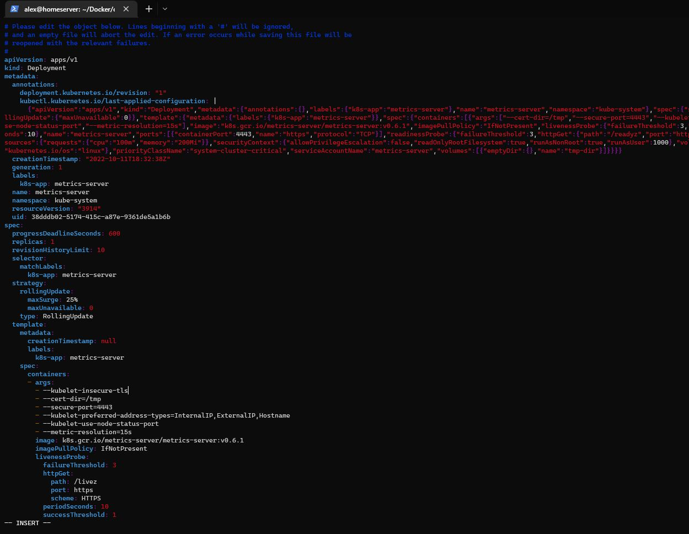
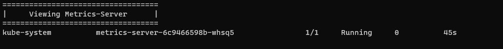
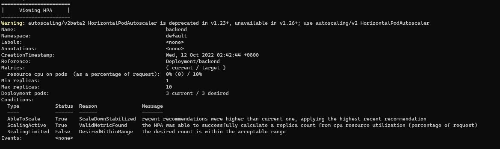
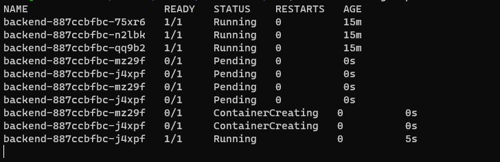

Name: Teo Yick Fong Alex

Student Number: A0221444R

[Github Repo](https://github.com/alexteo98/OTOT-A2-A3)

## Task A3
### Deploy a metrics-server and HorizontalPodAutoscaler
1. Creating metrics-server
    1. `kubectl apply -f https://github.com/kubernetes-sigs/metrics-server/releases/latest/download/components.yaml`
2. Disable TLS

3. Restart Deployment
   1. `kubectl -nkube-system rollout restart deploy/metrics-server`
4. Verify metrics-server
    1. `kubectl get pods --all-namespaces | grep metrics-server`

4. Creating HorizontalPodAutoscaler
    1. `kubectl apply -f ./manifests/hpa.yaml`
5. Verify HorizontalPodAutoscaler
    1. `kubectl describe hpa`

1. HPA Scaling up under load

## Task A3.2
### Deploy Docker image as zone-aware manner
1. Creating Zone Aware Deployment
    1. `kubectl apply -f ./manifests/backend-zone-aware.yaml`
1. Updating Ingress
    1. `kubectl apply -f ./manifests/ingress-zone-aware.yaml`
2. Viewing Pods
    1. `kubectl get po -lapp=backend-zone-aware -owide --sort-by='.spec.nodeName'`

## Deployed Site
